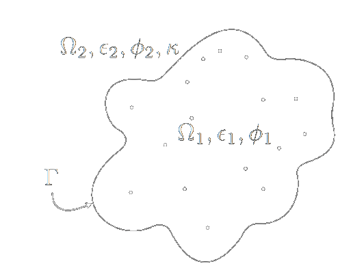
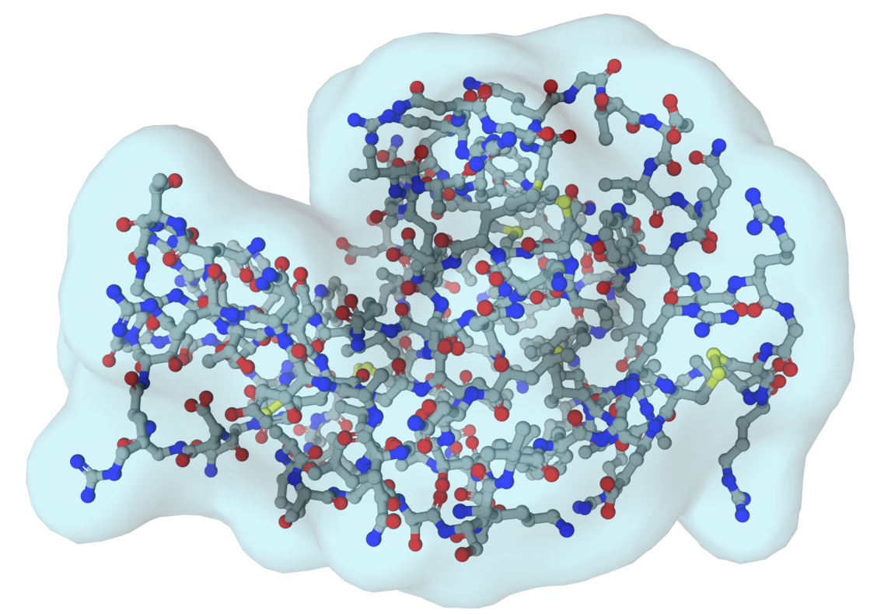

# XPINN Solver for 3D Poisson-Boltzmann Equation 

Simple Python Poisson-Boltzmann equation solver for real macromolecules in a polarizable media, using Extended Physics Informed Neural Networks. 

$$\nabla^2 \phi_1 = -\frac{1}{\epsilon_1}\sum_k q_k\delta(x_k) \quad x \in \Omega_1 $$

$$\nabla^2 \phi_2 = \kappa^2\phi_2 \quad x \in \Omega_2 $$


<p align="center">
  
</p>

## Features

- Solves the electrostatic potential for the solute and solvent domain.
- Simple molecule definition by .pdb or .pqr file.
- Different loss terms can be added to the model.
- Use of different architectures is available, very customizable.
- Weigths balancing algortithm implemented.
- Build in Python/Tensorflow.

<p align="center">
  
</p>


## Resources

- [Documents](./documents/): Check this folder for relevant papers and additional project documentation.
- [Tutorials](./tutorials/): Check this folder for notebooks tutorials.

## Installation

To install and run this project locally, follow these steps:

1. Clone the repository to your local machine.

   ```bash
   git clone https://github.com/MartinAchondo/XPPBE
   ```
2. Navigate to the project directory
   ```bash
   cd XPPBE
   ```
3. Create a virtual environment
   ```bash
   conda create --name xppbe python=3.8.18
   ```
4. Install the project
    ```bash
   pip install .
    ```

## Usage
To use this project, start by following the [Tutorial.ipynb](./tutorials/tutorial.ipynb) notebook. An explanation of this notebook is as follows:

1. Import the simulation object, the YAML file, and initialize it:
    ```py
    from xppbe.Simulation import Simulation
    simulation = Simulation('Main.yaml')
    ```
2. Run the simulation:
    ```py
    simulation.create_simulation()
    simulation.adapt_model()
    simulation.solve_model()
    simulation.postprocessing()
    ```
The Simulation object import a YAML file with all the problem definitions. An explanation is as follows:

1. Define the molecule, the properties and the equation to solve:
    ```yaml
    equation: standard
    pbe_model: linear

    domain_properties:
        molecule: methanol
        epsilon_1: 1
        epsilon_2: 80
        kappa: 0.125
        T: 300
    ```     
2. Define the number of collocation points (mesh properties):
    ```yaml
    mesh_properties:
        vol_max_interior: 0.04
        vol_max_exterior: 0.1
        density_mol: 10
        density_border: 4
        dx_experimental: 1.0
        N_pq: 100
        G_sigma: 0.04
        mesh_generator: msms
        probe_radius: 1,4
        dR_exterior: 3
        force_field: AMBER
    ```

3. Define the different loss terms (solute domain, solvent domain and combination of boths)
    ```yaml
    losses:
        - R1
        - R2
        - D2
        - Iu
        - Id
        - K2
    ```
4. Define the architectures:
    ```yaml
    network: xpinn

    hyperparameters_in:
        input_shape: [null, 3]
        num_hidden_layers: 4
        num_neurons_per_layer: 200
        output_dim: 1
        activation: tanh
        adaptative_activation: true
        architecture_Net: FCNN
        fourier_features: true
        num_fourier_features: 256

    hyperparameters_out:
        input_shape: [null, 3]
        num_hidden_layers: 4
        num_neurons_per_layer: 200
        output_dim: 1
        activation: tanh
        adaptative_activation: true
        architecture_Net: FCNN
        fourier_features: true
    ```

5. Finally, specify the optimization algorithm, the weights algorithm, the batches/samples approach and the number of iterations.
    ```yaml
    adapt_weights: true
    adapt_w_iter: 1000
    adapt_w_method: gradients
    alpha_w: 0.7         

    sample_method: random_sample
    
    optimizer: Adam
    lr:
        method: exponential_decay
        initial_learning_rate: 0.001
        decay_steps: 2000
        decay_rate: 0.9
        staircase: true

    N_iters: 20000
    ```

## Citing

If you find this project useful for your research or work, please consider citing it. Here is an example BibTeX entry:

```bibtex
@misc{XPINN-for-PBE,
  author    = {Martín Achondo},
  title     = {XPINN Solver for 3D Poisson-Boltzmann Equation},
  howpublished = {GitHub repository},
  year      = {2024},
  url       = {https://github.com/MartinAchondo/XPPBE},
}
```
