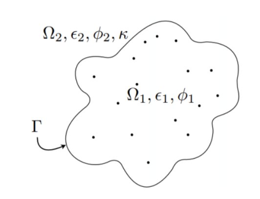

# XPINN Solver for 3D Poisson-Boltzmann Equation 

Simple Python Poisson-Boltzmann equation solver for real macromolecules in a polarizable media, using Extended Physics Informed Neural Networks. 

$$\nabla^2 \phi_1 = -\frac{1}{\epsilon_1}\sum_k q_k\delta(x_k) \quad x \in \Omega_1 $$

$$\nabla^2 \phi_2 = \kappa^2\phi_2 \quad x \in \Omega_2 $$

<p align="center">
  
</p>


## Features

- Solves the electrostatic potential for the solute and solvent domain.
- Simple molecule definition by .pqr file.
- Different loss terms can be added to the model.
- Use of different architectures is available, very customizable.
- Weigths balancing algortithm implemented.
- Build in Python/Tensofrlow.

## Resources

- [Documents](./documents/): Check this folder for relevant papers and additional project documentation.

## Installation

To install and run this project locally, follow these steps:

1. Clone the repository to your local machine.

   ```bash
   git clone https://github.com/MartinAchondo/XPINN-for-PBE-Simulation
   ```
2. Navigate to the project directory
   ```bash
   cd XPINN-for-PBE-Simulation
    ```
3. Install project dependecies:
    ```bash
   poetry install
    ```

## Usage
To use this project, start by modifying the [Main.py](./code/Main.py) template code. If you intend to run multiple simulations, add your customized `Main.py` files to the `code/simulations_list` folder. Finally, execute the following command:


```bash
bash run_simulations.bash
```

An explanation of the `Main.py` code is as follows:

1. Define the molecule and the properties:
    ```py
    inputs = {'molecule': 'methanol',
              'epsilon_1':  1,
              'epsilon_2': 80,
              'kappa': 0.125,
              'T' : 300 
              }
    ```     
2. Define the number of collocation points:
    ```py
    N_points = {'dx_interior': 0.2,
                'dx_exterior': 0.5,
                'N_border': 6,
                'dR_exterior': 10,
                'dx_experimental': 1,
                'N_pq': 10,
                'G_sigma': 0.04,
                'mesh_density': 3
                }
    ```

3. Define the different loss terms (solute domain, solvent domain and combination of boths)
    ```py
    meshes_in = dict()
    meshes_in['1'] = {'type':'R', 'fun':lambda x,y,z: PBE_model.source(x,y,z)}
    meshes_in['2'] = {'type':'Q', 'fun':lambda x,y,z: PBE_model.source(x,y,z)}
    meshes_in['3'] = {'type':'K', 'file':'data_known.dat'}
    meshes_in['4'] = {'type':'P', 'file':'data_precond.dat'}

    meshes_out = dict()
    meshes_out['1'] = {'type':'R', 'value':0.0}
    meshes_out['2'] = {'type':'D', 'fun':lambda x,y,z: PBE_model.border_value(x,y,z)}
    meshes_out['3'] = {'type':'K', 'file':'data_known.dat'}
    meshes_out['4'] = {'type':'P', 'file':'data_precond.dat'}

    meshes_domain = dict()
    meshes_domain['1'] = {'type':'I'}
    meshes_domain['2'] = {'type':'E', 'file':'data_experimental.dat'}
    meshes_domain['3'] = {'type':'G'}
    ```
4. Define the architectures:
    ```py
    hyperparameters_in = {
                    'input_shape': (None,3),
                    'num_hidden_layers': 2,
                    'num_neurons_per_layer': 20,
                    'output_dim': 1,
                    'activation': 'tanh',
                    'architecture_Net': 'FCNN',
                    'fourier_features': True,
                    'num_fourier_features': 128
            }

    hyperparameters_out = {
                    'input_shape': (None,3),
                    'num_hidden_layers': 2,
                    'num_neurons_per_layer': 20,
                    'output_dim': 1,
                    'activation': 'tanh',
                    'architecture_Net': 'FCNN',
                    'fourier_features': False
            }
    ```

5. Finally, specify the optimization algorithm, the weights algorithm and the batches/samples approach.
    ```py
    XPINN_solver.adapt_weights([weights,weights],
                                adapt_weights = True,
                                adapt_w_iter = 20,
                                adapt_w_method = 'gradients',
                                alpha = 0.7)             

    XPINN_solver.set_points_methods(
            sample_method='batches', 
            N_batches=1)

    optimizer = 'Adam'
    lr = tf.keras.optimizers.schedules.ExponentialDecay(
            initial_learning_rate=0.001,
            decay_steps=2000,
            decay_rate=0.9,
            staircase=True)
    XPINN_solver.adapt_optimizers(optimizer,[lr,lr])
    ```

6. And solve the PDE:
    ```py
    N_iters = 10000

    XPINN_solver.solve(N=N_iters, 
                    precond = False, 
                    save_model = 0, 
                    G_solve_iter=100)
    ```

7. For quick postprocessing, use the Postprocessing class:
    ```py
    Post = Postprocessing(XPINN_solver, save=True, directory=folder_path)
    ```
    Or the [Postprocessing Jupyter Notebook](./code/Post/post.ipynb).
